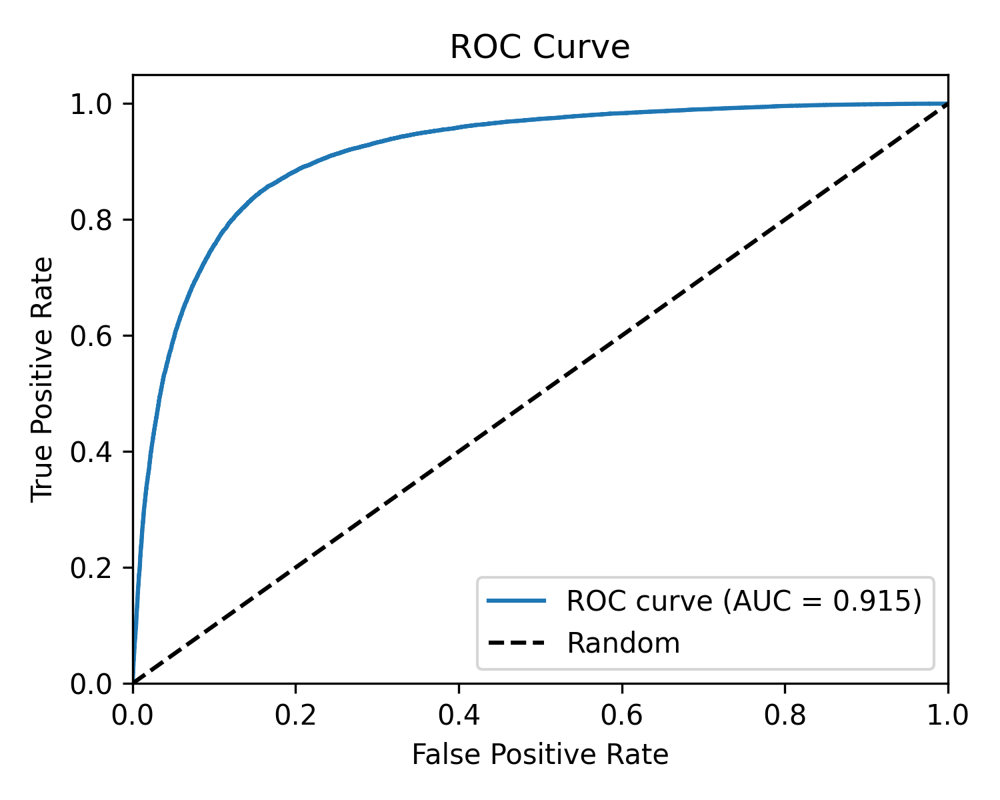
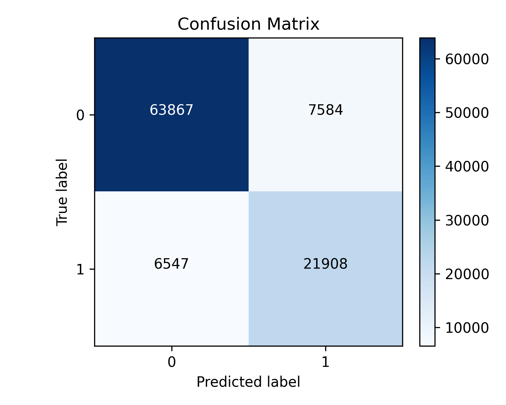
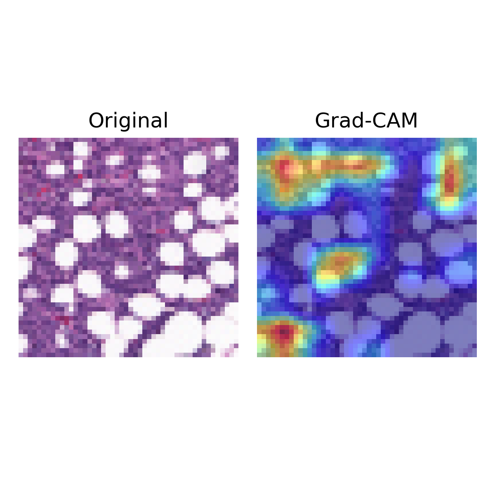
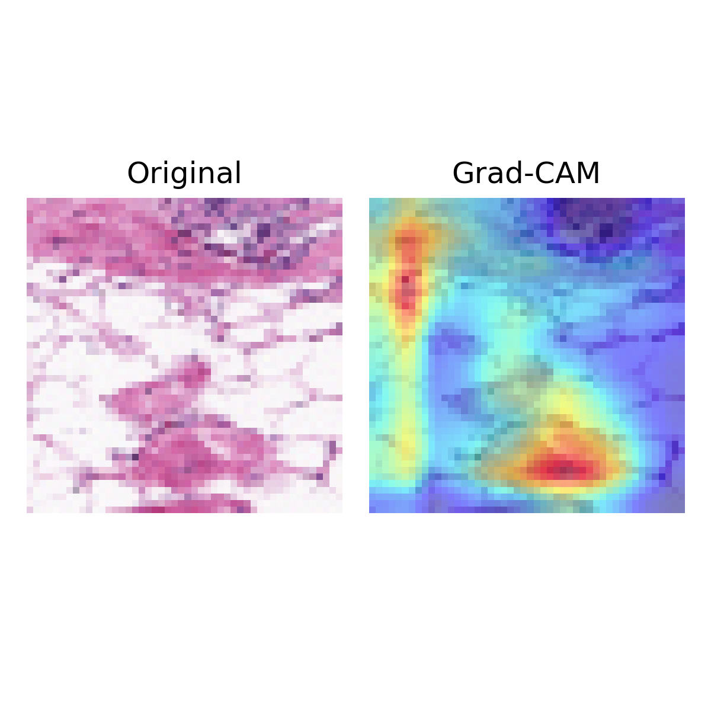

# CancerNet

A convolutional neural network that classifies breast histopathology image
patches as benign or invasive ductal carcinoma, trained on the IDC dataset.

**Test set: 99,906 patches. Accuracy 85.9%. ROC AUC 0.915.**




## Results in full

| Metric | Value |
|---|---|
| Accuracy | 85.86% |
| ROC AUC | 0.915 |
| Specificity (benign correctly identified) | 89.39% |
| Sensitivity (malignant correctly identified) | 76.99% |
| Precision | 74.28% |
| F1 | 0.756 |

Confusion matrix: TN 63,867 &middot; FP 7,584 &middot; FN 6,547 &middot; TP 21,908

The number that matters clinically is sensitivity, and at 77% it is the
weakest result here: roughly one malignant patch in four is missed. The
dataset is about 72% benign, so accuracy flatters the model and the
minority class is where it struggles. Class weighting, a decision
threshold tuned for recall rather than the default 0.5, and patch level
aggregation into slide level predictions are the obvious next steps, and
none of them are done here.

## Architecture

`cancernet/cancernet.py` defines CancerNet v2:

- Block 1: two standard `Conv2D` layers (32 filters) for low level features
- Blocks 2 and 3: `SeparableConv2D` (64, then 128 filters) for parameter efficiency
- `BatchNormalization` after every activation, progressive dropout (0.25, 0.30, 0.40)
- `GlobalAveragePooling2D` instead of `Flatten` into the classifier head

The v1 architecture is kept commented at the top of the same file for
comparison. It started from the CancerNet design published in the
PyImageSearch breast cancer classification tutorial; v2 is a rework of it,
swapping the all separable stack for a mixed one, replacing Flatten with
global average pooling, and retuning dropout.

## Training

`train_model.py`, with `ImageDataGenerator` augmentation (rotation, shift,
shear, zoom, flips), Adam at 1e-3, `ReduceLROnPlateau`, and `EarlyStopping`
restoring the best weights. Trained on a CUDA enabled TensorFlow build.

## Interpretability

`gradcam_examples.py` produces Grad-CAM overlays showing which regions of a
patch drove each prediction.

| Malignant | Benign |
|---|---|
|  |  |

## Layout

```
cancernet/cancernet.py   model definition
cancernet/config.py      dataset paths and split ratios
build_dataset.py         splits the raw IDC download into train/val/test
train_model.py           training, evaluation, and the plots above
gradcam_examples.py      Grad-CAM overlays
```

## Dataset

The IDC regular dataset (~280k 50x50 patches) is not the property of this
repo. Download it from Kaggle, point `cancernet/config.py` at it, then run
`python build_dataset.py` to produce the train/validation/test split.
